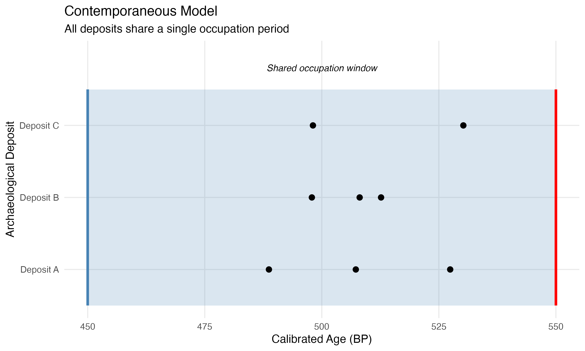
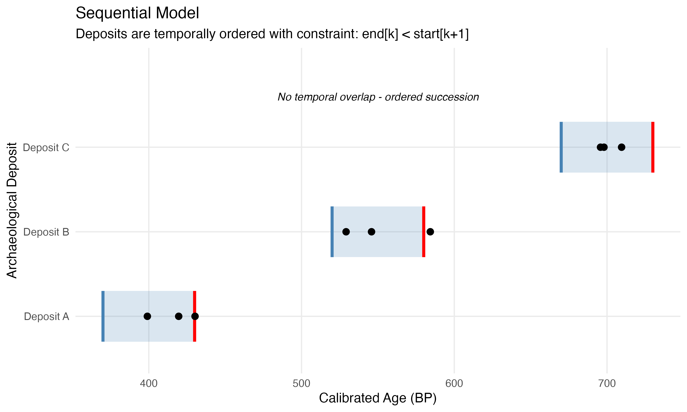
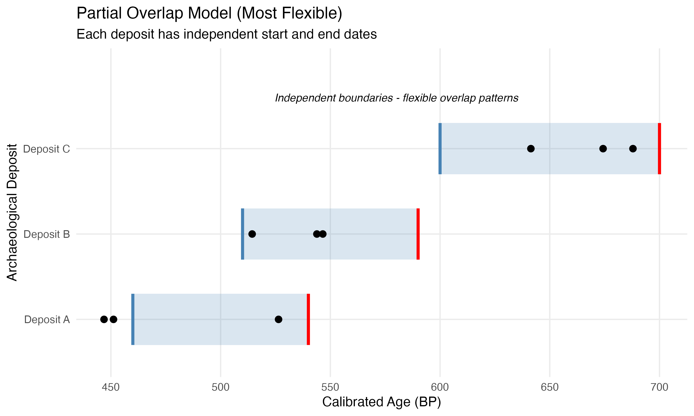

# Bayesian Assessment of Contemporaneity in Radiocarbon Dates

A comprehensive R and Stan pipeline for analyzing radiocarbon dates from multiple archaeological deposits to assess temporal contemporaneity using Bayesian hierarchical models.

## Overview

This project provides a complete, documented framework for:

1. **Radiocarbon calibration** using IntCal20 via `rcarbon`
2. **Bayesian hierarchical modeling** in Stan to assess deposit contemporaneity
3. **Model comparison** using LOO cross-validation
4. **Simulation-based validation** with known ground truth
5. **Comprehensive visualization** of results and diagnostics

## Project Structure

```
project/
├── R/                          # R functions
│   ├── setup.R                 # Package management and setup
│   ├── data_validation.R       # Data validation functions
│   ├── calibration.R           # Radiocarbon calibration wrappers
│   ├── simulation.R            # Simulation framework
│   ├── stan_utilities.R        # Stan interface functions
│   ├── contemporaneity_metrics.R  # Metric calculation
│   ├── plotting.R              # Visualization functions
│   └── validation_framework.R  # Model validation system
├── stan/                       # Stan models
│   ├── contemporaneous_model.stan
│   ├── sequential_model.stan
│   └── partial_overlap_model.stan
├── tests/                      # Unit tests
│   └── testthat/
│       ├── test_data_validation.R
│       ├── test_calibration.R
│       └── test_simulation.R
├── data/                       # Data directory
├── docs/                       # Documentation
├── analysis.qmd                # Main analysis document (Quarto)
└── README.md                   # This file
```

## Installation

### Prerequisites

- R (≥ 4.0.0)
- RStudio (optional, recommended)
- C++ compiler (for Stan)

### Quick Start

```r
# Clone or download this repository
# Set working directory to project root

# Run setup script
source("R/setup.R")
complete_setup()
```

This will:
- Install all required R packages
- Install CmdStan toolchain
- Verify Stan installation
- Print package versions

### Required Packages

- `rcarbon` - Radiocarbon calibration
- `cmdstanr` - Stan interface (recommended over `rstan`)
- `posterior` - Posterior distribution analysis
- `bayesplot` - Diagnostic plots
- `loo` - Model comparison
- `dplyr`, `tidyr` - Data manipulation
- `ggplot2` - Visualization
- `testthat` - Unit testing
- `quarto` - Document rendering

## Example Analysis & Visualizations

This section shows example results from analyzing 5 archaeological sites with 43 radiocarbon dates.

### Sample Data

The analysis used radiocarbon dates from:
- **Broome_Tech** (9 dates)
- **CCE_Site** (4 dates)
- **Chenango_Point** (12 dates)
- **Hill_Creek** (4 dates)
- **Thomas_Luckey** (14 dates)

### Key Results

**Contemporaneity Findings**:
- Broome_Tech, Chenango_Point, and Thomas_Luckey show **100% overlap probability** → definitely contemporaneous
- CCE_Site and Hill_Creek show **0.5% overlap** with the main group → likely NOT contemporaneous

**Occupation Spans** (95% credible intervals):
- Broome_Tech: ~909-437 cal BP (duration ~685 years)
- CCE_Site: ~452-492 cal BP (duration ~38 years)
- Chenango_Point: ~792-371 cal BP (duration ~594 years)
- Hill_Creek: ~659-680 cal BP (duration ~15 years)
- Thomas_Luckey: ~705-444 cal BP (duration ~393 years)

### Example Visualizations

#### 1. Calibrated Radiocarbon Dates

Calibrated probability distributions for all 43 radiocarbon dates:


Each curve shows the calibrated probability distribution for a single radiocarbon date. The x-axis shows calibrated years BP (Before Present), and dates are grouped by site. The calibration accounts for variations in atmospheric radiocarbon over time using the IntCal20 curve.

#### 2. Occupation Boundaries

Posterior distributions for site occupation start and end dates:


This plot shows the Bayesian posterior distributions for when each site's occupation began (blue) and ended (red). Wider distributions indicate greater uncertainty.

#### 3. Temporal Overlap

Site occupation spans with median dates:


Horizontal bars show the estimated occupation span for each site. Blue dots mark the start date (older), red dots mark the end date (younger). Note the strong overlap between Broome_Tech, Chenango_Point, and Thomas_Luckey.

#### 4. Overlap Probability Matrix

Pairwise contemporaneity probabilities:


This heatmap shows the probability that each pair of sites was contemporaneous (temporally overlapping). Values near 1.0 (yellow) indicate high probability of overlap, while values near 0 (dark blue) indicate minimal probability of overlap.

#### 5. Posterior Predictive Check

Model fit assessment:


This plot compares the observed radiocarbon age distribution (black line) against the model's posterior predictive distributions (blue lines, 50 samples shown). Good model fit is indicated when the observed distribution falls within the range of predicted distributions. The plot shows good agreement between observed and predicted radiocarbon ages.

### Running the Example

To reproduce this analysis:

```r
# Run full analysis
source("run_full_analysis.R")

# Run hypothesis tests
source("run_hypothesis_tests.R")

# Render paper
quarto render paper_template.qmd --to pdf
```

Results will be saved to:
- `output/sample_analysis/`: Main analysis outputs (plots, CSV files, metrics)
- `output/hypothesis_tests/`: Hypothesis testing results (overlap durations, precedence, ordering)
- `paper_template.pdf`: Complete research paper with all results

### Hypothesis Testing Capabilities

The framework includes comprehensive hypothesis testing for temporal relationships:

**Overlap Duration Analysis** (`pairwise_overlap_durations.csv`):
- Mean overlap duration in years for each site pair
- 95% credible intervals for overlap estimates
- Probability of overlap exceeding specific thresholds (50, 100, 200 years)

**Temporal Precedence Tests** (`precedence_tests.csv`):
- Probability that one site completely precedes another (no overlap)
- Gap duration between end of earlier site and start of later site
- Directional relationships with statistical significance

**Temporal Ordering Hypotheses** (`ordering_hypotheses.csv`):
- Tests competing hypotheses about the overall temporal sequence
- Posterior probabilities for alternative orderings
- Relative support for each hypothesis

**Complete Overlap Tests** (`complete_overlap_tests.csv`):
- Probability that one site's occupation is fully contained within another's
- Useful for identifying nested settlement patterns

## Using This Framework for Your Own Data

This framework is designed to be adapted for any radiocarbon-based contemporaneity study. Follow these steps to analyze your own dataset and generate a publication-ready research paper.

### Step 1: Prepare Your Data

Create a CSV file in the `data/` directory with the following required columns:

```csv
site,material,lab_no,c14_age,c14_error,reference
"MySite1","charcoal","Beta-12345",2450,30,"Smith 2020"
"MySite1","maize","AA-54321",2480,35,"Smith 2020"
"MySite2","charcoal","Beta-12346",2520,40,"Jones 2021"
```

**Required columns**:
- `site`: Site or deposit name (string)
- `material`: Sample material type (string)
- `lab_no`: Laboratory code for the radiocarbon determination (string)
- `c14_age`: Conventional radiocarbon age in BP (numeric)
- `c14_error`: Laboratory measurement error (1σ) (numeric)
- `reference`: Citation for the date (string, optional)

**Data requirements**:
- Minimum 3 dates per site for reliable boundary estimation
- Sites with <3 dates will be excluded from analysis
- Use short-lived materials (seeds, charcoal from twigs) when possible
- Avoid old-wood effects

### Step 2: Create a Study Configuration File

Create a file `my_study_config.R` with information about your study:

```r
# Study Configuration
# This information will be incorporated into the paper template

# Study metadata
study_title <- "Assessing Contemporaneity of Bronze Age Settlements in the Thames Valley"
study_subtitle <- "A Bayesian Approach Using Radiocarbon Chronology"

author_name <- "Jane Smith"
author_affiliation <- "Department of Archaeology, University College London"
author_email <- "j.smith@ucl.ac.uk"

# Study region and period
study_region <- "Thames Valley, southern England"
study_period <- "Middle Bronze Age (ca. 3500-3000 BP)"
study_culture <- "Bronze Age settlement complexes"

# Research questions (as a character vector)
research_questions <- c(
  "Were the five settlement sites occupied simultaneously?",
  "Do sites cluster into distinct chronological phases?",
  "What is the duration of occupation at each settlement?"
)

# Site descriptions (named list)
site_descriptions <- list(
  "Site_A" = "A large Bronze Age settlement with extensive midden deposits",
  "Site_B" = "Smaller riverside settlement with evidence of metalworking",
  "Site_C" = "Hilltop enclosure with defensive earthworks",
  "Site_D" = "Open settlement with multiple roundhouse structures",
  "Site_E" = "Ritual site with evidence of feasting activities"
)

# Archaeological context (paragraph describing the background)
archaeological_context <- "
The Middle Bronze Age in the Thames Valley is characterized by the emergence
of large, relatively permanent settlements often located on river terraces.
These sites show evidence of increased social complexity, specialized craft
production, and extensive exchange networks. Understanding the temporal
relationships between these settlements is crucial for reconstructing Bronze
Age social organization, settlement hierarchies, and the development of
proto-urban centers in southern Britain. The contemporary occupation of
multiple large sites would suggest a complex settlement system, while
temporal separation might indicate sequential occupation or population
movement.
"

# Interpretation guidelines (what contemporaneity would mean)
contemporaneity_implications <- "
If these sites were contemporaneous, it would suggest:
1. A regional settlement network with multiple coeval communities
2. Sufficient agricultural productivity to support multiple large settlements
3. Potential hierarchical relationships between settlements
4. Evidence for Bronze Age social complexity in the region

Temporal separation would instead indicate:
1. Sequential occupation phases
2. Possible population movement or settlement relocation
3. Changes in settlement strategy over time
"

# Additional context for discussion
discussion_points <- list(
  material_culture = "All sites share similar ceramic assemblages belonging to the Deverel-Rimbury tradition",
  subsistence = "Charred grain assemblages indicate mixed agriculture with barley and emmer wheat",
  landscape = "All sites occupy river terrace locations with access to arable land and water",
  regional_context = "Part of a broader pattern of Middle Bronze Age settlement nucleation in lowland Britain"
)
```

### Step 3: Run the Analysis

```r
# Load your configuration
source("my_study_config.R")

# Load your data
my_data <- read.csv("data/my_radiocarbon_data.csv")

# Validate data
source("R/data_validation.R")
validate_c14_data(my_data)

# Filter to sites with sufficient dates (≥3)
library(dplyr)
site_counts <- my_data %>%
  group_by(site) %>%
  summarise(n = n()) %>%
  filter(n >= 3)

analysis_data <- my_data %>%
  filter(site %in% site_counts$site)

cat("Analyzing", length(unique(analysis_data$site)), "sites with",
    nrow(analysis_data), "radiocarbon dates\n")

# Run calibration and Bayesian analysis
source("R/calibration.R")
source("R/stan_utilities.R")
source("R/contemporaneity_metrics.R")
source("R/plotting.R")

# Calibrate dates
cal_result <- calibrate_dates(
  ages = analysis_data$c14_age,
  errors = analysis_data$c14_error,
  lab_codes = analysis_data$lab_no
)

# Prepare Stan data
stan_data <- prepare_stan_data(analysis_data, cal_result)

# Compile and fit model
model <- compile_stan_model("stan/partial_overlap_model.stan")
fit <- fit_stan_model(model, stan_data,
                      iter_warmup = 1000,
                      iter_sampling = 2000,
                      chains = 4)

# Compute metrics
n_sites <- length(unique(analysis_data$site))
metrics <- compute_all_metrics(fit, n_deposits = n_sites)

# Save results
output_dir <- "output/my_study"
dir.create(output_dir, recursive = TRUE, showWarnings = FALSE)

# Generate plots
ggsave(file.path(output_dir, "occupation_boundaries.png"),
       plot_occupation_boundaries(fit, n_sites),
       width = 10, height = 6, dpi = 300)

ggsave(file.path(output_dir, "temporal_overlap.png"),
       plot_temporal_overlap_from_metrics(metrics$occupation_spans,
                                         unique(analysis_data$site)),
       width = 10, height = 6, dpi = 300)

ggsave(file.path(output_dir, "overlap_matrix.png"),
       plot_overlap_matrix(metrics$overlap_matrix, unique(analysis_data$site)),
       width = 8, height = 7, dpi = 300)

# Save results as CSV
write.csv(metrics$occupation_spans,
          file.path(output_dir, "occupation_spans.csv"),
          row.names = FALSE)

write.csv(metrics$overlap_matrix,
          file.path(output_dir, "overlap_matrix.csv"),
          row.names = FALSE)
```

### Step 4: Generate Your Custom Paper

Create a customized Quarto paper using your study configuration:

```r
# Load the paper template generator
source("R/generate_paper.R")

# Generate customized paper
generate_custom_paper(
  config_file = "my_study_config.R",
  data_file = "data/my_radiocarbon_data.csv",
  results_dir = "output/my_study",
  output_file = "my_paper.qmd"
)

# The function will create my_paper.qmd with:
# - Your title, author, and affiliation
# - Your archaeological context and research questions
# - Your site descriptions integrated into the text
# - References to your specific results
# - Your interpretation guidelines in the discussion
```

Then render to PDF or HTML:

```bash
# Render to PDF
quarto render my_paper.qmd --to pdf

# Or render to HTML for easier sharing
quarto render my_paper.qmd --to html
```

### Step 5: Customize and Refine

The generated paper includes:

1. **Automatic integration** of your study-specific text:
   - Research questions
   - Site descriptions
   - Archaeological context
   - Interpretation guidelines

2. **All figures and tables** from your analysis:
   - Calibrated radiocarbon dates
   - Occupation boundaries
   - Temporal overlap
   - Overlap probability matrix
   - Model diagnostics

3. **Computed metrics** automatically inserted:
   - Site occupation spans
   - Overlap probabilities
   - Duration estimates

**Manual customization**:

After generation, you can edit the `.qmd` file to:
- Add additional references to your `references.bib`
- Refine interpretations in the Discussion section
- Add supplementary analyses
- Adjust figure captions
- Include additional archaeological context

### Example Workflow

Complete example using the framework:

```r
# 1. Setup
source("R/setup.R")
complete_setup()  # Install dependencies if needed

# 2. Load your study configuration
source("my_study_config.R")

# 3. Load and validate data
my_data <- read.csv("data/my_radiocarbon_data.csv")
validate_c14_data(my_data)

# 4. Run analysis (this takes 10-20 minutes)
source("run_analysis_custom.R")  # Template script provided

# 5. Generate paper
generate_custom_paper(
  config_file = "my_study_config.R",
  data_file = "data/my_radiocarbon_data.csv",
  results_dir = "output/my_study",
  output_file = "my_paper.qmd"
)

# 6. Render final paper
system("quarto render my_paper.qmd --to pdf")

# 7. Review my_paper.pdf - ready for journal submission!
```

### Tips for Success

**Data preparation**:
- Use consistent site naming (no special characters)
- Ensure all dates use the same calibration curve (e.g., IntCal20 for Northern Hemisphere)
- Include marine reservoir corrections if analyzing marine samples
- Document any excluded dates with justification

**Study configuration**:
- Be specific about your research questions
- Provide detailed site descriptions with relevant context
- Frame interpretations in terms of your research questions
- Reference regional archaeological literature

**Analysis decisions**:
- Start with the partial overlap model (most flexible)
- Use model comparison if testing specific hypotheses (contemporaneous vs. sequential)
- Check MCMC diagnostics (R-hat < 1.01, ESS > 400)
- Verify posterior predictive checks show good model fit

**Paper customization**:
- Add regional maps showing site locations
- Include photographs or illustrations of sites/artifacts
- Expand discussion with comparisons to other regional studies
- Add supplementary materials with additional diagnostics

### Troubleshooting

**Problem**: "Too few dates per site"
- **Solution**: Combine related deposits or features, or increase sampling

**Problem**: "Poor MCMC convergence"
- **Solution**: Increase iterations, adjust adapt_delta, check for data errors

**Problem**: "Overlap probabilities all near 0.5"
- **Solution**: May indicate insufficient temporal resolution; add more dates or accept uncertainty

**Problem**: "Posterior predictive checks show poor fit"
- **Solution**: Check for outliers, verify calibration curve is appropriate, consider measurement errors

## Usage (Quick Reference)

### Quick Example

```r
# Load functions
source("R/setup.R")
source("R/data_validation.R")
source("R/calibration.R")
source("R/simulation.R")
source("R/stan_utilities.R")
source("R/contemporaneity_metrics.R")
source("R/plotting.R")

# 1. Prepare data
c14_data <- data.frame(
  lab_code = c("OxA-1", "OxA-2", "Beta-1", "Beta-2"),
  age = c(2450, 2480, 2520, 2550),
  error = c(30, 35, 40, 30),
  deposit = c("A", "A", "B", "B")
)

# 2. Validate
validate_c14_data(c14_data)

# 3. Calibrate
cal_result <- calibrate_dates(
  ages = c14_data$age,
  errors = c14_data$error,
  lab_codes = c14_data$lab_code
)

# 4. Prepare for Stan
stan_data <- prepare_stan_data(c14_data, cal_result)

# 5. Compile and fit model
model <- compile_stan_model("stan/partial_overlap_model.stan")
fit <- fit_stan_model(model, stan_data)

# 6. Analyze results
metrics <- compute_all_metrics(fit, n_deposits = 2)
print_metrics_summary(metrics)

# 7. Visualize
plot_temporal_overlap(fit, n_deposits = 2)
plot_overlap_matrix(metrics$overlap_matrix)
```

### Running Full Analysis

To run the complete analysis workflow:

```bash
quarto render analysis.qmd
```

This generates an HTML report with all analyses, figures, and tables.

## Models

The framework includes three hierarchical Bayesian models, each representing different assumptions about temporal relationships between deposits. Visual representations below illustrate the key differences.

### 1. Contemporaneous Model

**Assumption**: All deposits share a single occupation window.

**Use case**: Testing hypothesis that all deposits are fully contemporaneous.

**Parameters**:
- `theta_start`: Shared start boundary (cal BP)
- `theta_end`: Shared end boundary (cal BP)
- `calendar_dates[n]`: True calendar date for each sample



*All three deposits share the same temporal boundaries (blue = start, red = end). Black dots represent individual radiocarbon dates.*

### 2. Sequential Model

**Assumption**: Deposits are temporally ordered with no overlap.

**Use case**: Testing hypothesis of stratigraphic succession.

**Parameters**:
- `theta_start[k]`: Start boundary for deposit k
- `theta_end[k]`: End boundary for deposit k
- Constraint: `theta_end[k] < theta_start[k+1]`



*Deposits are temporally ordered with gaps between them. Each has independent boundaries with the constraint that deposit k must end before deposit k+1 begins.*

### 3. Partial Overlap Model (Most Flexible)

**Assumption**: Each deposit has independent boundaries (allows any overlap pattern).

**Use case**: Default model for contemporaneity assessment.

**Parameters**:
- `theta_start[k]`: Start boundary for deposit k
- `theta_end[k]`: End boundary for deposit k
- No ordering constraints



*Each deposit has fully independent boundaries. This allows for any pattern: complete overlap, partial overlap, or no overlap. This is the most flexible model and is recommended as the default.*

## Model Comparison

Models are compared using PSIS-LOO cross-validation:

```r
comparison <- compare_models_loo(
  contemporaneous = fit_contemp,
  sequential = fit_seq,
  partial = fit_partial
)
```

**Interpretation**:
- **LOO weight > 0.9**: Strong evidence for model
- **LOO weight > 0.7**: Moderate evidence
- **LOO weight < 0.7**: Weak evidence; consider model averaging

## Validation

The framework includes comprehensive validation via simulation:

```r
# Run validation study
validation_results <- run_validation_study(
  n_trials = 100,
  scenarios = c("contemporaneous", "sequential", "partial"),
  sample_sizes = c(5, 10, 20),
  parallel = TRUE
)

# Summarize results
summary <- summarize_validation_results(validation_results)
print_validation_summary(summary)

# Visualize
plots <- plot_validation_study(validation_results)
print(plots$accuracy)
print(plots$coverage)
```

## Metrics

The following contemporaneity metrics are computed:

### Pairwise Overlap
- **Overlap probability**: P(deposits i and j overlap)
- **Overlap duration**: Expected length of overlap (years)

### Occupation Spans
- **Duration**: Length of occupation (with credible intervals)
- **Boundaries**: Start and end dates (with uncertainty)

### Multi-Deposit
- **Global overlap**: P(all deposits share common window)
- **Total time span**: Range encompassing all deposits

### Temporal Ordering
- **Sequence probability**: P(specific temporal order)

## Interpretation Guidelines

### Sample Size Recommendations

Based on validation studies:

| Scenario | Minimum Samples | Recommended |
|----------|----------------|-------------|
| Well-separated deposits | 5 per deposit | 10+ |
| Partially overlapping | 10 per deposit | 15+ |
| Fully contemporaneous | 8 per deposit | 12+ |

### Statistical vs. Cultural Contemporaneity

**Important**: Statistical overlap does not necessarily imply cultural contemporaneity:

- Statistical contemporaneity = temporal overlap within measurement uncertainty
- Cultural contemporaneity = actual simultaneous occupation or use
- Consider taphonomic processes, sample context, and archaeological interpretation

## Testing

Run unit tests:

```r
library(testthat)
test_dir("tests/testthat")
```

Tests cover:
- Data validation (edge cases, error checking)
- Simulation (parameter correctness, reproducibility)
- Calibration (numerical accuracy, structure)
- Stan utilities (integration)

## Reproducibility

For full reproducibility:

1. **Set random seeds** in all analysis scripts
2. **Record package versions**: `sessionInfo()`
3. **Document Stan version**: `cmdstanr::cmdstan_version()`
4. **Version control** all code and data
5. **Use relative file paths**

Example:

```r
set.seed(42)
sessionInfo()
cmdstanr::cmdstan_version()
```

## Calibration Curve

By default, IntCal20 is used [@reimer2020intcal20]. To use a different curve:

```r
cal_result <- calibrate_dates(
  ages = ages,
  errors = errors,
  calCurve = "intcal13"  # or "shcal20" for Southern Hemisphere
)
```

**Important**: IntCal20 is appropriate for Northern Hemisphere terrestrial samples. For marine samples or Southern Hemisphere, use appropriate curves and reservoir corrections.

## Troubleshooting

### Stan Compilation Errors

If Stan models fail to compile:

```r
# Reinstall CmdStan
cmdstanr::install_cmdstan(overwrite = TRUE)

# Check C++ compiler
cmdstanr::check_cmdstan_toolchain()
```

### Convergence Issues

If models show poor convergence:

1. Increase `adapt_delta`: `adapt_delta = 0.99`
2. Increase iterations: `iter_warmup = 2000, iter_sampling = 2000`
3. Increase `max_treedepth`: `max_treedepth = 15`
4. Check for label switching or multimodality
5. Provide better initial values

### Memory Issues

For large datasets:

- Use `method = "mixture"` for calibration (faster)
- Reduce number of posterior samples
- Use parallelization carefully

## Citation

If you use this framework, please cite:

```
[Project Citation]

And the key software packages:
- Stan: Carpenter et al. (2017)
- rcarbon: Crema & Bevan (2021)
- IntCal20: Reimer et al. (2020)
```

## References

1. Bronk Ramsey, C. (2009). Bayesian analysis of radiocarbon dates. *Radiocarbon*, 51(1), 337-360.

2. Carpenter, B., et al. (2017). Stan: A probabilistic programming language. *Journal of Statistical Software*, 76(1).

3. Crema, E. R., & Bevan, A. (2021). Inference from large sets of radiocarbon dates: software and methods. *Radiocarbon*, 63(1), 23-39.

4. Reimer, P. J., et al. (2020). The IntCal20 Northern Hemisphere radiocarbon age calibration curve (0–55 cal kBP). *Radiocarbon*, 62(4), 725-757.

5. Vehtari, A., Gelman, A., & Gabry, J. (2017). Practical Bayesian model evaluation using leave-one-out cross-validation and WAIC. *Statistics and Computing*, 27(5), 1413-1432.

## License

[Specify license]

## Contributing

Contributions welcome! Please:

1. Fork the repository
2. Create a feature branch
3. Add tests for new functionality
4. Ensure all tests pass
5. Submit a pull request

## Contact

[Contact information]

## Acknowledgments

This framework builds on methods developed by Christopher Bronk Ramsey (OxCal), the Stan Development Team, and the rcarbon package developers.
