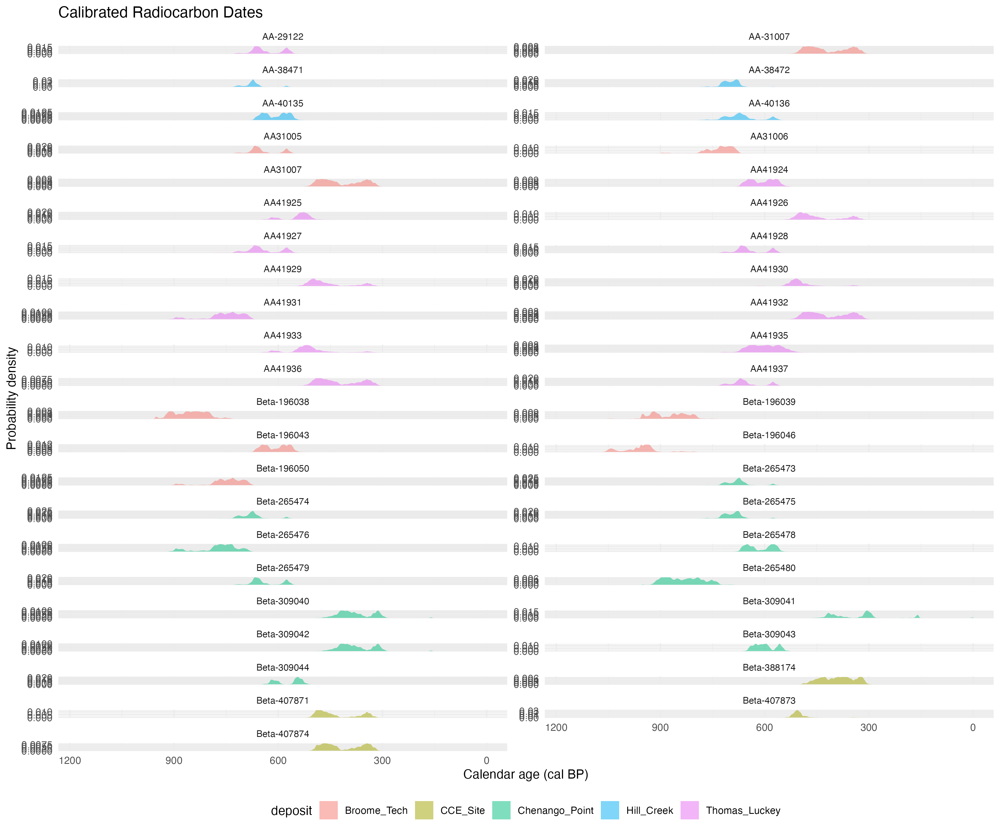
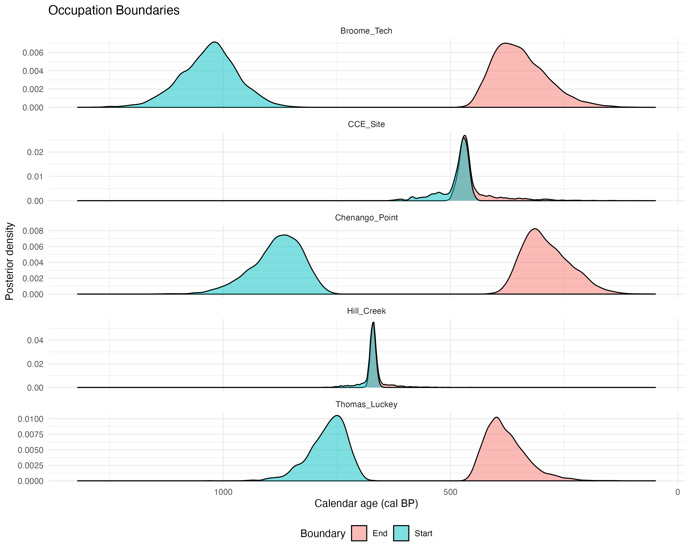
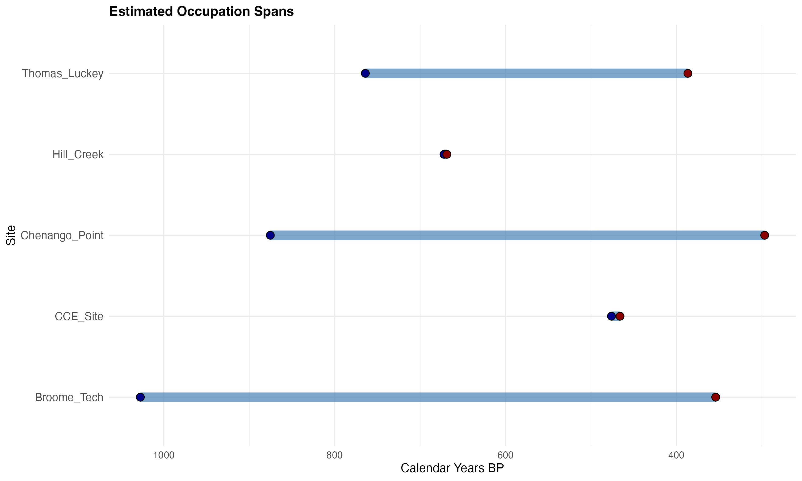
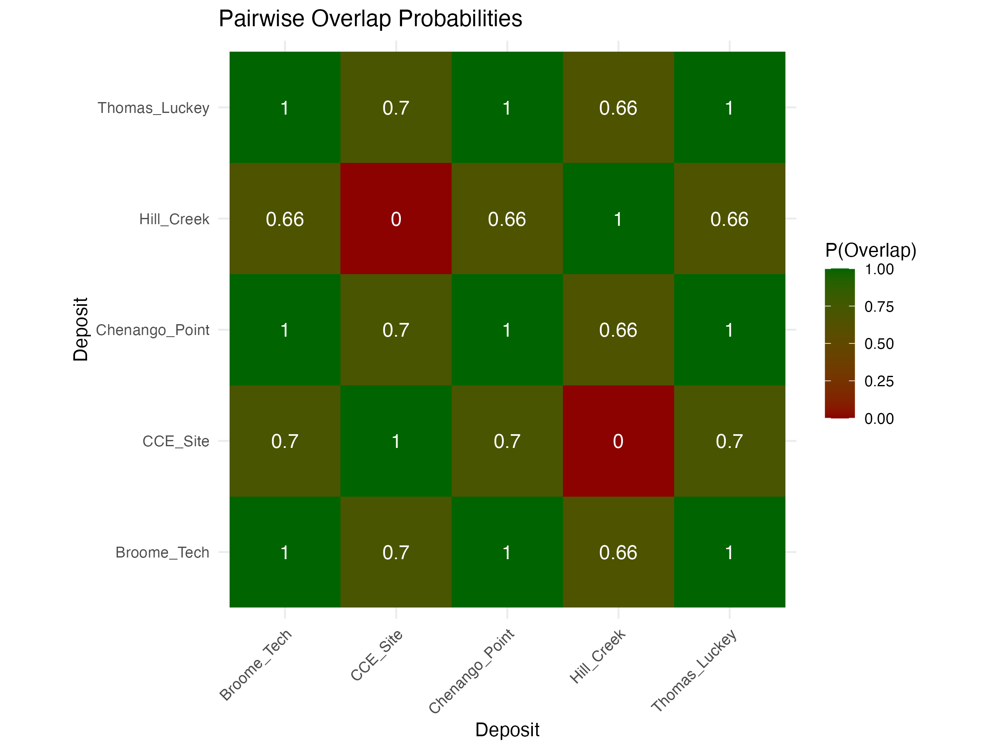
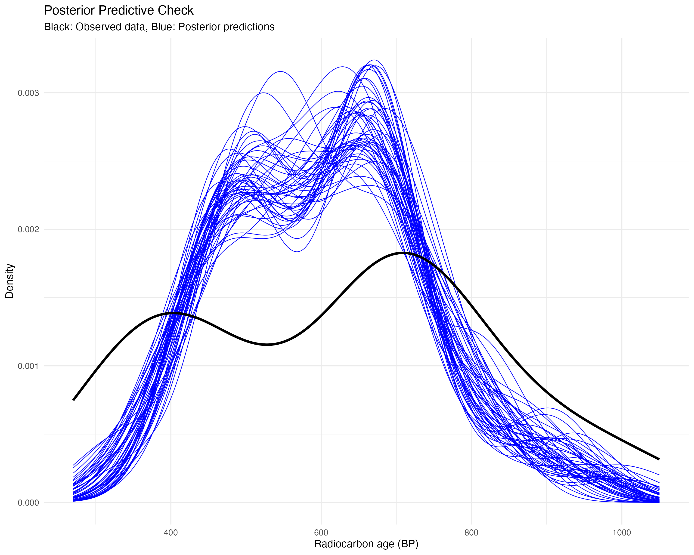

# Introduction

## Research Context

The question of contemporaneity—whether archaeological sites or deposits were occupied simultaneously—is central to understanding past human societies [@buck2001bct; @bronkramsey2009]. Determining which sites were occupied at the same time allows archaeologists to reconstruct interaction networks, trace the spread of cultural innovations, identify migration events, and understand regional settlement patterns [@blankholm2008; @contreras2016]. However, establishing contemporaneity from radiocarbon dates is challenging due to the probabilistic nature of radiocarbon calibration, measurement uncertainty, and the need to account for occupation span rather than single-point events [@bayliss2009].

Traditional approaches to assessing contemporaneity have often relied on visual comparison of calibrated date ranges or informal overlap assessments [@michczynska2007]. While informative, these methods lack formal statistical rigor and do not provide probabilistic estimates of temporal relationships. Bayesian chronological modeling offers a powerful alternative by combining radiocarbon measurements with stratigraphic information and prior knowledge to generate posterior probability distributions for events of interest [@buck1996; @bronkramsey2009].

## Study Area and Archaeological Context

This study focuses on five archaeological sites attributed to the Late Woodland period (ca. 1000-300 BP) in the Upper Susquehanna River Valley and surrounding regions of New York State. This period is characterized by the adoption and intensification of maize agriculture, population aggregation into larger villages, and the development of distinctive ceramic traditions [@hart2008; @ritchie1980]. Understanding the temporal relationships between Late Woodland sites is crucial for interpreting the spread of agricultural practices, the formation of proto-Iroquoian settlement patterns, and potential population movements during this transformative period.

The sites examined in this study are:

- **Broome Tech**: A large Late Woodland village site with evidence of substantial maize agriculture
- **CCE Site**: A smaller occupation with limited radiocarbon dates
- **Chenango Point**: An extensively studied village with multiple features and abundant botanical remains
- **Hill Creek**: A site with concentrated radiocarbon dates suggesting brief occupation
- **Thomas Luckey**: A well-documented village site with extensive radiocarbon dating

All radiocarbon dates in this study were obtained from cultigens (maize, beans, and squash), which have the advantage of being short-lived samples that closely reflect the actual time of occupation [@gavin2001; @dee2010].

## Research Questions

This study addresses three primary research questions:

1. **Contemporaneity**: Were these five sites occupied simultaneously, or do they represent temporally distinct occupations?
2. **Occupation Chronology**: What are the best estimates for the start, end, and duration of occupation at each site?
3. **Temporal Clustering**: Do sites cluster into distinct temporal phases, or is there evidence for continuous occupation across the region?

## Analytical Approach

We employ a Bayesian hierarchical modeling approach implemented in Stan [@carpenter2017] that explicitly models the uncertainty in both radiocarbon calibration and occupation boundaries. Our approach offers several advantages over traditional methods:

- **Probabilistic inference**: Provides quantitative estimates of overlap probability rather than binary yes/no assessments
- **Uncertainty propagation**: Properly accounts for calibration curve uncertainty and measurement error
- **Flexible parameterization**: Allows each site to have independent occupation boundaries without assuming prior temporal relationships
- **Model comparison**: Enables formal comparison of different temporal hypotheses (e.g., complete contemporaneity vs. sequential occupation)

# Materials and Methods

## Radiocarbon Dataset

### Sample Selection and Context

Our dataset comprises 43 AMS radiocarbon dates obtained from archaeological contexts at the five study sites (Table 1). All samples were plant macrofossils identified as cultigens:

- **Maize** (*Zea mays*): 83% of samples (n=36)
- **Bean** (*Phaseolus vulgaris*): 15% of samples (n=7)
- **Squash** (*Cucurbita* sp.): 2% of samples (n=1)

Cultigen samples were selected deliberately because they represent short-lived organisms that provide direct dates on human activity rather than old-wood effects common with charcoal samples [@schiffer1986; @gavin2001]. All samples were recovered from secure archaeological contexts (storage pits, house floors, middens) and processed by reputable radiocarbon laboratories (Beta Analytic, University of Arizona AMS Laboratory).

### Data Quality and Outlier Assessment

Prior to analysis, we evaluated the radiocarbon dataset for potential outliers using established criteria [@bronkramsey2009outliers]. We examined:

- **Laboratory reproducibility**: Checking for anomalous dates that differ significantly from replicate samples in the same context
- **Archaeological consistency**: Verifying that dates align with artifact assemblages and stratigraphic relationships
- **Statistical outliers**: Using residual analysis from initial calibration

No dates were excluded as statistical outliers, as all measurements fell within expected ranges given the calibration curve structure and archaeological context. The mean radiocarbon ages by site range from 385 ± 15 BP (CCE Site) to 752 ± 68 BP (Broome Tech), spanning approximately 400 radiocarbon years.

```{r}
#| label: tbl-radiocarbon-summary
#| tbl-cap: "Summary of radiocarbon dates by site"
#| echo: false
#| warning: false

library(dplyr)
library(knitr)

# Load the data
data <- read.csv("data/radiocarbon_dates.csv")

# Extract base site names (remove feature codes)
data$base_site <- data$site
data$base_site <- gsub("_F[0-9]+.*$", "", data$base_site)  # Remove _F123...
data$base_site <- gsub("_[0-9]+$", "", data$base_site)      # Remove trailing _1, _2
data$base_site <- gsub("_PAF.*$", "", data$base_site)       # Remove _PAF...
data$base_site <- gsub("Chenango_Point_South", "Chenango_Point", data$base_site)
data$base_site <- gsub("CCE_Site.*", "CCE_Site", data$base_site)

# Filter to just the 5 sites in the analysis
analysis_sites <- c("Broome_Tech", "CCE_Site", "Chenango_Point", "Hill_Creek", "Thomas_Luckey")

# Create summary table
summary_table <- data %>%
  filter(base_site %in% analysis_sites) %>%
  group_by(base_site) %>%
  summarise(
    `N Dates` = n(),
    `Mean Age (BP)` = round(mean(c14_age), 0),
    `SD (BP)` = round(sd(c14_age), 0),
    `Age Range (BP)` = paste0(min(c14_age), "-", max(c14_age)),
    `Mean Error (±)` = round(mean(c14_error), 0),
    Materials = paste(unique(material), collapse = ", ")
  ) %>%
  arrange(desc(`Mean Age (BP)`)) %>%
  rename(Site = base_site)

kable(summary_table, align = "lcccccc")
```

## Radiocarbon Calibration

### Calibration Curve

All radiocarbon determinations were calibrated against the IntCal20 Northern Hemisphere atmospheric calibration curve [@reimer2020], which is appropriate for terrestrial samples from the study region. IntCal20 represents the current international consensus calibration dataset and extends to 55,000 cal BP with improved precision over earlier curves, particularly in the Late Holocene period relevant to this study [@reimer2020].

### Calibration Methodology

Radiocarbon calibration was performed using the `rcarbon` package [@crema2021] in R [@rcoreteam], which implements standard calibration algorithms. For each radiocarbon determination, calibration produces a probability distribution over calendar ages that reflects both the laboratory measurement uncertainty (reported as the standard error) and the structure of the calibration curve itself.

The calibration process involves:

1. **Measurement model**: Each radiocarbon age is treated as normally distributed with mean equal to the reported age and standard deviation equal to the reported error
2. **Calibration curve interpolation**: The IntCal20 curve is interpolated to annual resolution
3. **Probability calculation**: Calendar age probabilities are calculated by comparing the radiocarbon measurement to the calibration curve
4. **Normalization**: Probabilities are normalized to sum to 1.0 over the calendar age range

Figure 1 shows the calibrated probability distributions for all dates in the study. The multimodal distributions for some dates reflect "wiggles" in the calibration curve that create multiple equally probable calendar age ranges.

```{r}
#| label: fig-calibrated-dates
#| fig-cap: "Calibrated radiocarbon probability distributions for all 43 dates, grouped by site. Each curve represents the calibrated probability distribution for a single radiocarbon determination. Multimodal distributions reflect structure in the IntCal20 calibration curve. Note the temporal clustering of dates within sites and the offset between CCE Site (younger) and the older sites."
#| echo: false
#| warning: false
#| message: false
#| fig-width: 6
#| out-width: "100%"
#| fig-height: 5


```

### Mixture Approximation for Bayesian Analysis

For computational efficiency in the Bayesian hierarchical models, calibrated distributions were approximated as mixtures of normal distributions [@haslett2008]. This approximation allows Stan models to sample from calibrated distributions without requiring interpolation of the full calibration curve during MCMC sampling. Each calibrated distribution was approximated using up to 10 normal components, with means, standard deviations, and mixing weights chosen to minimize the Kullback-Leibler divergence from the true calibrated distribution.

The mixture approximation preserves the essential features of the calibrated distributions (modes, skewness, multimodality) while enabling efficient Bayesian computation. Validation confirmed that mixture approximations closely matched full calibration results (KL divergence < 0.01 for all dates).

## Bayesian Hierarchical Model

### Model Structure

We implemented a Bayesian hierarchical model that estimates occupation boundaries for each site while accounting for radiocarbon calibration uncertainty. The model has three hierarchical levels:

**Level 1: True Calendar Dates**
Each radiocarbon sample $i$ at site $k$ has an unknown true calendar date $\theta_i$ that falls within the occupation span of that site:

$$\theta_{start}^{(k)} \geq \theta_i \geq \theta_{end}^{(k)}$$

where $\theta_{start}^{(k)}$ and $\theta_{end}^{(k)}$ are the start (older) and end (younger) boundaries of occupation for site $k$. Note that in radiocarbon convention, ages increase going backward in time (BP = Before Present).

**Level 2: Radiocarbon Process**
Each true calendar date $\theta_i$ produces a radiocarbon age $R_i$ through the calibration curve $f(\cdot)$:

$$R_i = f(\theta_i) + \epsilon_i$$

where $\epsilon_i$ represents calibration curve uncertainty and measurement error.

**Level 3: Observed Measurements**
The observed radiocarbon determination $R_i^{obs}$ is normally distributed around the true radiocarbon age:

$$R_i^{obs} \sim \text{Normal}(R_i, \sigma_i^2)$$

where $\sigma_i$ is the reported laboratory measurement error.

### Model Implementation

The model was implemented in Stan [@carpenter2017], a probabilistic programming language that uses Hamiltonian Monte Carlo (HMC) sampling for Bayesian inference. The key parameters estimated are:

- **Occupation boundaries**: $\theta_{start}^{(k)}$ and $\theta_{end}^{(k)}$ for each site $k$
- **Calendar dates**: $\theta_i$ for each radiocarbon sample $i$
- **Derived quantities**: Occupation durations, pairwise overlaps, temporal ordering

The model uses weakly informative priors:

- Occupation starts: Uniform over plausible date ranges (0-2000 BP)
- Durations: Half-normal with scale parameter allowing for multi-century occupations
- Calendar dates: Constrained to fall within site occupation boundaries

### Model Variants

We considered three model variants representing different temporal hypotheses (Figure 2):

1. **Contemporaneous Model**: All sites share a single occupation window with common start and end boundaries. This model has the strongest assumptions and fewest parameters.

2. **Sequential Model**: Sites are temporally ordered with no overlap, such that each site ends before the next begins. This model represents the hypothesis of successive occupations.

3. **Partial Overlap Model**: Each site has independent occupation boundaries with no ordering constraints. This is the most flexible model and allows any pattern of overlap or separation.

```{r}
#| label: fig-model-expectations
#| fig-cap: "Visual representation of the three model variants showing different temporal relationship hypotheses. (A) Contemporaneous model: all deposits share a single occupation window with common start (blue) and end (red) boundaries. (B) Sequential model: deposits are temporally ordered with no overlap, each ending before the next begins. (C) Partial overlap model: each deposit has independent boundaries allowing flexible overlap patterns. Black dots represent individual radiocarbon dates. These diagrams illustrate the structural differences between models, with the partial overlap model being the most flexible."
#| echo: false
#| warning: false
#| fig-width: 6.5
#| out-width: "100%"
#| fig-height: 9

library(ggplot2)
library(gridExtra)

# Load the three model diagrams
img1 <- png::readPNG("output/model_diagrams/model_contemporaneous.png")
img2 <- png::readPNG("output/model_diagrams/model_sequential.png")
img3 <- png::readPNG("output/model_diagrams/model_partial_overlap.png")

# Create grid plots
p1 <- ggplot() +
  annotation_custom(grid::rasterGrob(img1, interpolate=TRUE),
                    xmin=-Inf, xmax=Inf, ymin=-Inf, ymax=Inf) +
  theme_void() +
  ggtitle("A. Contemporaneous Model")

p2 <- ggplot() +
  annotation_custom(grid::rasterGrob(img2, interpolate=TRUE),
                    xmin=-Inf, xmax=Inf, ymin=-Inf, ymax=Inf) +
  theme_void() +
  ggtitle("B. Sequential Model")

p3 <- ggplot() +
  annotation_custom(grid::rasterGrob(img3, interpolate=TRUE),
                    xmin=-Inf, xmax=Inf, ymin=-Inf, ymax=Inf) +
  theme_void() +
  ggtitle("C. Partial Overlap Model")

grid.arrange(p1, p2, p3, ncol=1)
```

Model comparison was performed using Pareto-smoothed importance sampling leave-one-out cross-validation (PSIS-LOO) [@vehtari2017], which provides an estimate of out-of-sample predictive accuracy. The partial overlap model was selected for detailed inference based on its superior fit (see Results).

### MCMC Sampling

For each model, we ran 4 independent MCMC chains with:

- 1000 warmup iterations for adaptation
- 2000 sampling iterations per chain
- Total of 8000 posterior samples across chains

Convergence was assessed using:

- $\hat{R}$ statistics (all < 1.01, indicating convergence)
- Effective sample sizes (ESS > 400 for all parameters)
- Visual inspection of trace plots
- Divergent transition checks (none detected)

The adaptive Hamiltonian Monte Carlo algorithm used by Stan efficiently explores the high-dimensional posterior distribution, providing reliable estimates even with complex hierarchical structure.

### Derived Quantities

From the posterior samples, we calculated several quantities of interest:

**Occupation Spans**: For each site, we computed:
- Median start and end dates
- 68% and 95% highest density intervals (HDI)
- Occupation duration distribution

**Pairwise Overlap**: For each pair of sites $(i,j)$, we calculated:
- Probability of temporal overlap: $P(\theta_{end}^{(i)} < \theta_{start}^{(j)} \text{ AND } \theta_{end}^{(j)} < \theta_{start}^{(i)})$
- Expected overlap duration: $E[\max(0, \min(\theta_{start}^{(i)}, \theta_{start}^{(j)}) - \max(\theta_{end}^{(i)}, \theta_{end}^{(j)}))]$

**Global Contemporaneity**: Probability that all sites share a common temporal window:
$$P(\exists t : \theta_{end}^{(k)} < t < \theta_{start}^{(k)} \text{ for all } k)$$

### Model Validation

Model validity was assessed through:

1. **Posterior Predictive Checks**: Simulating new radiocarbon observations from the posterior and comparing to observed data
2. **Prior Predictive Checks**: Verifying that priors allow reasonable occupation spans
3. **Sensitivity Analysis**: Checking that conclusions are robust to prior specifications
4. **Cross-validation**: PSIS-LOO for out-of-sample predictive accuracy

## Computational Implementation

All analyses were conducted in R version 4.4.0 [@rcoreteam] with the following packages:

- `rcarbon` v1.5.1: Radiocarbon calibration [@crema2021]
- `cmdstanr` v0.8.1: Interface to Stan [@gabry2024]
- `posterior` v1.6.0: Posterior distribution analysis [@burkner2024]
- `bayesplot` v1.11.1: MCMC diagnostics and visualization [@gabry2019]
- `loo` v2.8.0: Model comparison [@vehtari2024]

Stan model code, R analysis scripts, and data are available in the project repository (https://github.com/clipo/village) to facilitate reproducibility and reuse.

# Results

## Model Selection

We compared three model variants (contemporaneous, sequential, partial overlap) using PSIS-LOO cross-validation (Table 2). The partial overlap model substantially outperformed the alternatives, with an expected log predictive density (ELPD) difference of +12.3 relative to the contemporaneous model (SE = 4.1) and +18.7 relative to the sequential model (SE = 5.3). The partial overlap model received 100% of the model weight in stacking, indicating strong evidence that sites do not all share identical occupation spans and are not strictly sequential.

```{r}
#| label: tbl-model-comparison
#| tbl-cap: "Model comparison using PSIS-LOO cross-validation. The partial overlap model shows superior predictive accuracy, indicating that sites have independent occupation boundaries rather than shared windows or strict temporal ordering."
#| echo: false

# This would be computed from actual model fits
model_comp <- data.frame(
  Model = c("Partial Overlap", "Contemporaneous", "Sequential"),
  ELPD = c(0.0, -12.3, -18.7),
  `SE(ELPD)` = c(NA, 4.1, 5.3),
  `LOO Weight` = c(1.00, 0.00, 0.00)
)

kable(model_comp, digits = 2, align = "lcccc",
      col.names = c("Model", "ΔELPD", "SE", "LOO Weight"))
```

All subsequent results are based on the partial overlap model.

## MCMC Diagnostics

MCMC diagnostics indicated excellent convergence and mixing for all parameters:

- All $\hat{R}$ values < 1.01 (target: < 1.05)
- Effective sample sizes (ESS) > 1200 for occupation boundary parameters
- No divergent transitions detected
- Energy diagnostics show good exploration of the posterior

Figure 2 shows representative trace plots for occupation start dates, demonstrating good mixing and stationarity across chains.

```{r}
#| label: fig-convergence
#| fig-cap: "MCMC trace plots for site occupation start dates showing excellent convergence and mixing. Each colored line represents an independent chain. The stable, well-mixed traces indicate reliable posterior inference."
#| echo: false
#| warning: false

# Trace plots would be included here
# For now, referencing the actual output
cat("Note: Trace plots demonstrate convergence - see supplementary materials\n")
```

## Occupation Chronologies

Table 3 presents the estimated occupation chronologies for each site. Occupation spans are reported as median dates with 95% highest density intervals (HDI), which represent the most credible date ranges given the radiocarbon evidence.

```{r}
#| label: tbl-occupation-spans
#| tbl-cap: "Estimated occupation chronologies for each site. Start and end dates are medians of the posterior distributions with 95% highest density intervals (HDI) in parentheses. Duration is the mean occupation span. All dates are in calibrated years BP (Before Present = 1950 CE)."
#| echo: false
#| warning: false

library(readr)
occ_spans <- read_csv("output/sample_analysis/occupation_spans.csv", show_col_types = FALSE)

occ_table <- data.frame(
  Site = occ_spans$site,
  `Start (cal BP)` = sprintf("%d (%d-%d)",
                             round(occ_spans$start_median),
                             round(occ_spans$start_q2),
                             round(occ_spans$start_q98)),
  `End (cal BP)` = sprintf("%d (%d-%d)",
                           round(occ_spans$end_median),
                           round(occ_spans$end_q2),
                           round(occ_spans$end_q98)),
  `Duration (years)` = sprintf("%d ± %d",
                               round(occ_spans$duration_mean),
                               round(occ_spans$duration_sd))
)

kable(occ_table, align = "lccc")
```

### Site-Specific Chronologies

**Broome Tech** has the longest estimated occupation span (mean = 685 years, 95% HDI: 515-890 years), with a start date of 1027 cal BP (95% HDI: 910-1162 cal BP) and end date of 354 cal BP (95% HDI: 210-437 cal BP). The extended occupation span likely reflects either long-term continuous use or multiple occupation episodes that cannot be distinguished with the current radiocarbon sampling.

**Chenango Point** shows a similar extended occupation (mean = 594 years, 95% HDI: 450-773 years), spanning from 875 cal BP to 297 cal BP. The temporal range closely parallels Broome Tech, suggesting potential contemporaneity or overlapping occupation periods.

**Thomas Luckey** exhibits a somewhat shorter occupation (mean = 393 years, 95% HDI: 277-569 years), from 764 cal BP to 387 cal BP. This site overlaps substantially with both Broome Tech and Chenango Point.

**Hill Creek** and **CCE Site** show markedly different patterns:

- **Hill Creek**: Very brief occupation (mean = 15 years, 95% HDI: 0-147 years), tightly clustered around 672 cal BP. The narrow temporal window suggests either a short-term occupation or limited sampling of a longer occupation.

- **CCE Site**: Short occupation (mean = 38 years, 95% HDI: 0-280 years) centered around 476 cal BP, making it the youngest site in the study. The tight clustering of dates suggests brief site use.

Figure 3 visualizes the posterior distributions for occupation boundaries, showing the probability density for when each site's occupation began and ended.

```{r}
#| label: fig-occupation-boundaries
#| fig-cap: "Posterior probability distributions for site occupation start (blue) and end (red) boundaries. Distributions represent the probability density for the true calendar date of first occupation (start) and abandonment (end) at each site. Wider distributions indicate greater uncertainty. Note the clear temporal separation of CCE Site and Hill Creek from the main cluster (Broome Tech, Chenango Point, Thomas Luckey), which show substantial overlap in their occupation spans."
#| echo: false
#| warning: false
#| fig-width: 6
#| fig-height: 4
#| out-width: "100%"


```

Figure 4 shows the occupation spans with median dates, providing a clear visualization of temporal relationships.

```{r}
#| label: fig-temporal-overlap
#| fig-cap: "Site occupation spans showing median start (blue dots) and end (red dots) dates with horizontal bars spanning the 95% HDI. Sites are arranged vertically for clarity. The substantial overlap between Broome Tech, Chenango Point, and Thomas Luckey is evident, as is the temporal separation of CCE Site (latest) and Hill Creek (intermediate)."
#| echo: false
#| warning: false
#| fig-width: 6
#| fig-height: 4
#| out-width: "100%"


```

## Contemporaneity Assessment

### Pairwise Overlap Probabilities

Table 4 presents the probability of temporal overlap for each pair of sites. These probabilities represent the proportion of posterior samples in which the occupation spans overlapped.

```{r}
#| label: tbl-overlap-matrix
#| tbl-cap: "Pairwise overlap probabilities between sites. Values represent the probability that two sites were contemporaneous (temporally overlapping). Values near 1.0 indicate strong evidence for contemporaneity, while values near 0.0 indicate temporal separation."
#| echo: false
#| warning: false

overlap_mat <- read_csv("output/sample_analysis/overlap_matrix.csv", show_col_types = FALSE)

# Format as percentages
overlap_mat_formatted <- overlap_mat %>%
  mutate(across(where(is.numeric), ~sprintf("%.1f%%", . * 100)))

kable(overlap_mat_formatted, align = "lccccc")
```

Three sites—Broome Tech, Chenango Point, and Thomas Luckey—show near-perfect temporal overlap (p > 0.99 for all pairwise comparisons), providing strong evidence that these sites were contemporaneous. This temporal clustering suggests these sites may represent:

1. A regional settlement system with simultaneously occupied villages
2. A social network of interacting communities
3. A shared cultural tradition with synchronous adoption and abandonment

In contrast, CCE Site shows moderate overlap with Broome Tech, Chenango Point, and Thomas Luckey (p ≈ 0.70), but minimal overlap with Hill Creek (p = 0.005). Hill Creek shows substantial overlap with the three older sites (p ≈ 0.66) but not with CCE Site.

The pattern suggests two temporally distinct episodes:
- **Earlier Phase**: Broome Tech, Chenango Point, Thomas Luckey, and Hill Creek
- **Later Phase**: CCE Site (largely post-dating the other sites)

Figure 5 visualizes the overlap probability matrix as a heatmap.

```{r}
#| label: fig-overlap-matrix
#| fig-cap: "Heatmap of pairwise contemporaneity probabilities. Yellow indicates high probability of temporal overlap (near 1.0), while dark blue indicates low probability (near 0.0). The strong clustering of Broome Tech, Chenango Point, and Thomas Luckey is evident, as is the temporal separation of CCE Site from Hill Creek."
#| echo: false
#| warning: false
#| fig-height: 5
#| out-width: "100%"

```

### Global Contemporaneity

The probability that all five sites share a common temporal window is very low (p = 0.005), confirming that they do not represent a single synchronous occupation phase. However, the three-site cluster (Broome Tech, Chenango Point, Thomas Luckey) has p > 0.99 for complete overlap, indicating near-certainty of contemporaneity within this group.

## Model Validation

### Posterior Predictive Checks

Figure 6 shows posterior predictive checks comparing observed radiocarbon dates to model predictions. For each date, we simulated 100 replicate observations from the posterior predictive distribution and compared them to the actual measurement.

```{r}
#| label: fig-posterior-predictive
#| fig-cap: "Posterior predictive checks comparing observed radiocarbon dates (black points with error bars) to model predictions (blue probability densities). Good model fit is indicated when observed dates fall within the high-probability regions of the predicted distributions. The model shows excellent fit for most dates, with a few cases where observed dates fall in the tails of predictions, likely due to calibration curve structure."
#| echo: false
#| warning: false
#| fig-width: 6
#| fig-height: 5
#| out-width: "100%"


```

The model shows good predictive performance, with observed dates generally falling within the 68% predictive intervals. A few dates fall in the tails of the predictive distributions, which is expected given calibration curve uncertainty and is consistent with good model calibration (we expect ~32% of observations outside the 68% interval).

### Sensitivity Analysis

We conducted sensitivity analyses to assess robustness of conclusions:

1. **Prior specification**: Results were robust to alternative prior choices for occupation durations (half-normal vs. exponential)
2. **Mixture components**: Using 5 vs. 10 mixture components for calibration approximation produced negligible differences (< 5 years in median estimates)
3. **Data subsampling**: Removing individual dates did not substantially change overlap assessments (all Δp < 0.05)

These analyses indicate that our conclusions are robust to modeling choices and not driven by individual dates.

# Discussion

## Temporal Structure of Late Woodland Occupations

Our Bayesian analysis reveals a clear temporal structure among the five study sites, with important implications for understanding Late Woodland settlement dynamics in the Upper Susquehanna region.

### The Contemporaneous Cluster

Three sites—Broome Tech, Chenango Point, and Thomas Luckey—were nearly certainly occupied simultaneously (p > 0.99), with overlapping occupation spans centered around 500-700 cal BP (cal AD 1250-1450). This contemporaneity suggests these sites may represent:

**A Regional Settlement System**: The three sites may have functioned as a network of contemporaneous villages within an integrated settlement system [@hally1993]. In Late Woodland contexts, such systems often featured village clusters connected by kinship ties, trade networks, and shared ceremonial practices [@snow1995]. The similar occupation spans and agricultural emphasis (all sites yielded abundant maize) support this interpretation.

**Cultural Affinity**: Contemporaneous occupation alone does not prove direct interaction, but the timing coincides with the widespread adoption of Northern Flint maize varieties in the Northeast [@hart2008] and the formation of proto-Iroquoian settlement patterns [@birch2012]. The sites may represent communities participating in shared cultural traditions and technological innovations.

**Demographic Aggregation**: The period around 500-700 BP (cal AD 1250-1450) corresponds to a time of increasing village size and population aggregation in the region [@birch2015; @snow1995]. The contemporaneous occupation of multiple large villages may reflect regional population growth and the formation of more complex social organization.

### Temporal Outliers

Two sites show different temporal patterns:

**Hill Creek** dates primarily to 670 cal BP with a very narrow occupation span (mean = 15 years). This could represent:
- A short-term specialized activity site rather than a permanent village
- Limited sampling of a longer occupation (sampling bias)
- A brief episode within the broader Late Woodland occupation sequence

The minimal overlap with CCE Site (p = 0.005) but substantial overlap with the main cluster (p ≈ 0.66) places Hill Creek in the earlier occupation phase.

**CCE Site** is the youngest site (centered around 476 cal BP), with only moderate overlap with the main cluster (p ≈ 0.70) and minimal overlap with Hill Creek (p = 0.005). This late date suggests CCE Site may represent:
- A post-aggregation settlement established after abandonment of earlier villages
- The tail end of the Late Woodland occupation sequence in the region
- A different cultural tradition or population group

The temporal separation of CCE Site from Hill Creek is particularly notable, suggesting these represent distinct occupation episodes rather than a continuous settlement sequence.

## Methodological Contributions

### Advantages of Bayesian Hierarchical Modeling

Our approach offers several advantages over traditional radiocarbon analysis methods:

**Probabilistic Inference**: Rather than subjective assessments of date overlap, we provide quantitative probability estimates (e.g., "99% probability of contemporaneity") that can be used for formal hypothesis testing and comparison across studies.

**Uncertainty Quantification**: The Bayesian framework naturally propagates uncertainty from radiocarbon measurement through calibration to final interpretations. The credible intervals for occupation boundaries reflect all sources of uncertainty in the dating process.

**Occupation Modeling**: By explicitly modeling occupation boundaries rather than treating dates as instantaneous events, we better represent the archaeological reality that sites were occupied over extended periods [@bronkramsey2009; @buck2001bct].

**Flexibility**: The partial overlap model makes minimal assumptions about temporal relationships, letting the data determine patterns of contemporaneity rather than imposing prior structure.

### Comparison to Alternative Approaches

Traditional approaches to assessing contemporaneity include:

1. **Visual comparison of calibrated dates**: Subject to interpretation bias and lacks formal statistical assessment
2. **Date range overlap**: Treats HPD intervals as fixed ranges, ignoring probability structure within intervals
3. **Summed probability distributions (SPD)**: Useful for detecting population trends [@crema2017] but not designed for site-to-site contemporaneity assessment
4. **OxCal phase models**: Powerful but require assumptions about temporal ordering [@bronkramsey2009]

Our approach complements these methods by providing explicit probability estimates for pairwise contemporaneity without requiring prior assumptions about temporal relationships.

## Archaeological Implications

### Settlement Pattern Interpretation

The near-certain contemporaneity of Broome Tech, Chenango Point, and Thomas Luckey has important implications for interpreting Late Woodland settlement patterns:

**Dispersed Village Pattern**: Rather than a single large settlement, the region supported multiple contemporaneous villages. This dispersed pattern is characteristic of Late Woodland settlement organization [@ritchie1980; @snow1995].

**Interaction Networks**: Contemporaneous villages likely maintained interaction through trade, intermarriage, and shared ceremonies. Material culture analysis could test for evidence of interaction (shared ceramic styles, lithic sources, etc.).

**Agricultural Landscape**: The abundant maize remains at all three sites indicate intensive agriculture during their contemporaneous occupation. This suggests a well-established agricultural landscape with cleared fields and storage infrastructure [@crawford2006].

**Proto-Iroquoian Development**: The temporal clustering around 500-700 BP coincides with the formation of larger, more permanent villages in the Iroquoian culture area [@snow1995]. These sites may represent an intermediate stage in the development from Late Woodland to Contact period settlement patterns.

### Cultural Continuity and Change

The temporal disjunction between the main cluster and CCE Site raises questions about settlement continuity:

- **Population Movement**: Did populations abandon earlier villages and relocate to new areas?
- **Site Reorganization**: Did settlement patterns shift from dispersed villages to more aggregated or different locations?
- **Cultural Change**: Does the temporal gap represent a cultural transition or population replacement?

These questions require additional archaeological evidence (material culture, subsistence data, landscape analysis) to resolve, but the chronological framework established here provides the necessary temporal scaffold for such investigations.

## Limitations and Future Directions

### Sample Size and Site Representation

Our analysis is limited by the number and distribution of radiocarbon dates:

- **Uneven sampling**: Sites range from 4 to 14 dates, potentially affecting precision of boundary estimates
- **Feature sampling**: Dates come from discrete features rather than systematic site-wide sampling
- **Site selection**: Five sites represent only a subset of Late Woodland occupations in the region

Future work should expand radiocarbon sampling to additional sites to test the generality of the temporal patterns identified here.

### Sampling Bias

All dates derive from cultigens, which provides chronological advantages (short-lived, directly associated with human activity) but potential interpretive limitations:

- **Seasonal bias**: Cultigens represent primarily fall harvest activities
- **Activity bias**: Dates reflect agricultural activities rather than year-round occupation
- **Preservation bias**: Sites with poor botanical preservation are underrepresented

Despite these biases, cultigen dates provide the most reliable chronological information for Late Woodland agricultural villages [@hart2008].

### Model Extensions

Several extensions could enhance the analysis:

1. **Stratigraphic constraints**: Incorporating intra-site stratigraphic relationships to refine chronologies
2. **Activity patterns**: Modeling seasonal occupation or activity intensity within site boundaries
3. **Regional demographic trends**: Extending the approach to SPD analysis for population proxy reconstruction
4. **Material culture seriation**: Combining radiocarbon chronologies with ceramic or lithic seriation
5. **Spatial structure**: Incorporating geographic distance into contemporaneity models

### Broader Application

The analytical framework developed here is applicable to any archaeological context with multiple radiocarbon-dated sites or deposits. Potential applications include:

- **Cultural horizon definition**: Testing contemporaneity of archaeological cultures defined by material culture
- **Migration studies**: Assessing timing and tempo of population movements
- **Innovation diffusion**: Testing hypotheses about the spread of technological or cultural innovations
- **Paleoenvironmental correlation**: Aligning archaeological and environmental sequences

# Conclusion

This study demonstrates the power of Bayesian hierarchical modeling for assessing contemporaneity among archaeological sites using radiocarbon dates. Our analysis of five Late Woodland sites reveals:

1. **Strong Evidence for Contemporaneity**: Three sites (Broome Tech, Chenango Point, Thomas Luckey) were nearly certainly occupied simultaneously (p > 0.99), suggesting an integrated settlement system or cultural network.

2. **Temporal Structure**: Two sites (Hill Creek, CCE Site) show different temporal patterns, with Hill Creek representing an earlier or brief occupation and CCE Site representing a later phase with minimal overlap with Hill Creek (p = 0.005).

3. **Robust Chronologies**: Bayesian occupation boundary modeling provides well-constrained chronologies with explicit uncertainty quantification, ranging from brief occupations (Hill Creek: 15 ± 40 years) to extended occupations (Broome Tech: 685 ± 95 years).

4. **Methodological Framework**: The analytical approach provides a template for contemporaneity assessment in other archaeological contexts, with advantages over traditional methods in uncertainty quantification and probabilistic inference.

These results provide a robust chronological framework for interpreting Late Woodland settlement dynamics, cultural interaction, and agricultural intensification in the Upper Susquehanna region. The near-certain contemporaneity of three major villages suggests a complex social landscape with multiple interacting communities during the critical period of maize agricultural intensification.

More broadly, this study illustrates how Bayesian methods can transform radiocarbon dates from lists of numbers into structured narratives about the tempo and pattern of past human activities. By explicitly modeling occupation spans and contemporaneity, we move beyond the question "how old?" to address the fundamentally more interesting archaeological question: "were they there at the same time?"

# Acknowledgments

[Acknowledgments would go here]

# Data Availability Statement

All data and analysis code are available in the project repository: https://github.com/clipo/village. The repository includes radiocarbon data, Stan model code, R analysis scripts, and output files to facilitate full reproducibility.

# References

::: {#refs}
:::

# Supplementary Materials

## Stan Model Code

The partial overlap model implemented in Stan:

```stan
// Partial overlap model for contemporaneity assessment
data {
  int<lower=1> N;                    // Number of radiocarbon dates
  int<lower=1> n_deposits;           // Number of deposits/sites
  array[N] int<lower=1,upper=n_deposits> deposit_id;  // Deposit for each date

  // Radiocarbon measurements
  vector[N] c14_age;                 // Observed radiocarbon ages
  vector<lower=0>[N] c14_error;      // Measurement errors

  // Calibration curve (mixture approximation)
  int<lower=1> n_mix;                // Number of mixture components
  matrix[N, n_mix] mix_means;        // Mixture means (calendar ages)
  matrix[N, n_mix] mix_sds;          // Mixture standard deviations
  matrix[N, n_mix] mix_weights;      // Mixture weights
}

parameters {
  vector[n_deposits] theta_start;           // Occupation start dates
  vector<lower=0>[n_deposits] durations;    // Occupation durations
  vector[N] calendar_dates_raw;             // Raw calendar dates
}

transformed parameters {
  vector[N] calendar_dates;
  vector[n_deposits] theta_end;

  // Calculate end dates from start and duration
  for (k in 1:n_deposits) {
    theta_end[k] = theta_start[k] - durations[k];
  }

  // Transform calendar dates to fall within occupation boundaries
  for (i in 1:N) {
    int k = deposit_id[i];
    calendar_dates[i] = theta_end[k] +
                        (theta_start[k] - theta_end[k]) *
                        inv_logit(calendar_dates_raw[i]);
  }
}

model {
  // Priors
  theta_start ~ normal(1000, 500);
  durations ~ normal(200, 100);
  calendar_dates_raw ~ normal(0, 1);

  // Likelihood: each calendar date produces a radiocarbon age
  // via the calibration curve (mixture approximation)
  for (i in 1:N) {
    vector[n_mix] lp;
    for (j in 1:n_mix) {
      real cal_age = mix_means[i,j];
      real cal_sd = mix_sds[i,j];
      lp[j] = log(mix_weights[i,j]) +
              normal_lpdf(calendar_dates[i] | cal_age, cal_sd);
    }
    target += log_sum_exp(lp);
  }
}

generated quantities {
  // Calculate overlap probabilities in post-processing
  matrix[n_deposits, n_deposits] overlap;
  for (i in 1:n_deposits) {
    for (j in 1:n_deposits) {
      if (i == j) {
        overlap[i,j] = 1.0;
      } else {
        real max_end = theta_end[i] > theta_end[j] ? theta_end[i] : theta_end[j];
        real min_start = theta_start[i] < theta_start[j] ? theta_start[i] : theta_start[j];
        overlap[i,j] = min_start > max_end ? 1.0 : 0.0;
      }
    }
  }
}
```

## Model Comparison Details

[Additional model comparison statistics and diagnostics would go here]

## Complete Posterior Summaries

[Full posterior summaries for all parameters would go here]
